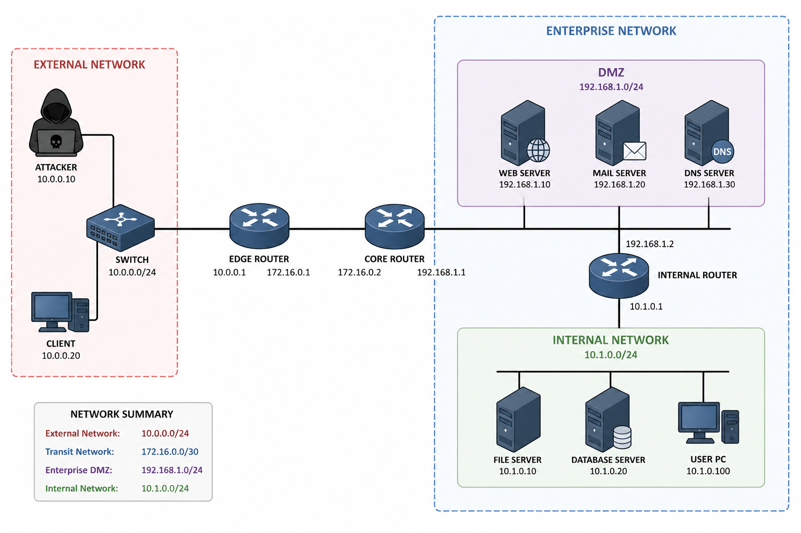

# Enterprise Network Security Lab

Welcome to the enterprise network security lab.  This lab starts with a very vulnerable network and guides you through a series of attacks and defences.  By completing the exercises, you will learn networking fundamentals, how common attacks work, and how to harden an enterprise network.

## Overview

The lab environment consists of three subnets:

- **LAN** – a local network where an attacker and a client reside.  They share a virtual switch implemented using a Docker bridge network.
- **DMZ** – a demilitarized zone containing publicly accessible services (a web server and an FTP server).
- **Internal network** – a protected network where internal hosts live.

These networks are connected by three routers configured with static routes to forward traffic.  The default configuration is intentionally insecure: services run without encryption, there is no firewall, and the routers accept spoofed traffic.  Your goal is to attack and then secure this environment step by step.

## Labs

| Lab | Description |
| --- | --- |
| [00 – Basic networking and reconnaissance](labs/00-basic-networking.md) | Explore the network, understand IP addressing and routing, and learn to capture and spoof packets. |
| [01 – ARP poisoning and MITM](labs/01-arp-poisoning.md) | Perform ARP cache poisoning to intercept traffic, then implement defences such as static ARP and DAI. |
| [02 – IP fragmentation & ICMP attacks](labs/02-ip-icmp-attacks.md) | Launch fragmentation and Smurf attacks, experiment with ICMP redirects, and enable reverse‑path filtering. |
| [03 – UDP amplification attacks](labs/03-udp-amplification.md) | Use misconfigured services to amplify traffic and flood the target; implement rate limiting to defend. |
| [04 – TCP attacks and session hijacking](labs/04-tcp-attacks.md) | Conduct SYN flooding, TCP reset and hijacking attacks, then apply countermeasures like SYN cookies. |
| [05 – DNS attacks](labs/05-dns-attacks.md) | Poison local DNS caches, perform Kaminsky‑style remote poisoning and DNS rebinding, and learn about DNSSEC. |
| [06 – Heartbleed and protocol flaws](labs/06-heartbleed.md) | Exploit the Heartbleed vulnerability to leak server memory, then patch OpenSSL and verify the fix. |
| [07 – Firewalls and evasion](labs/07-firewalls.md) | Build a simple stateful firewall using netfilter, write filtering rules, and test evasion techniques. |
| [08 – VPN tunnelling](labs/08-vpn.md) | Create a TUN/TAP‑based VPN to tunnel through firewalls, then extend to a TLS/SSL‑based mini VPN. |
| [09 – Network hardening and monitoring](labs/09-hardening.md) | Combine previous defences to harden the enterprise network: enable NAT, IDS/IPS, segmentation and patch services. |

Each lab includes learning objectives, background theory, step‑by‑step tasks and discussion questions.

## Quick start

If you have not yet set up the lab environment, follow the instructions in `README.md` and `docker/docker-compose.yml` to build and start the network.  Then work through the labs in order, referring back to this index as needed.  Feel free to modify and extend the environment—for example, by adding new services or experimenting with firewalls and VPNs.

Good luck, and have fun learning about network security!
